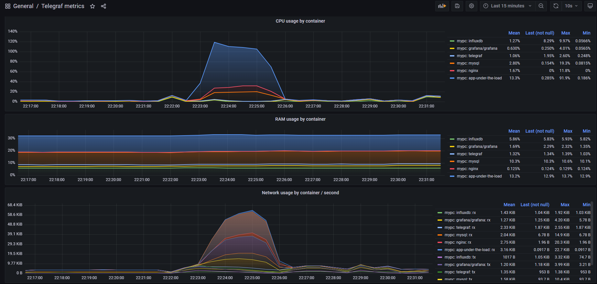

# HLA HW 2
### App for load generation 

To build an app run 
``gradle bootBuildImage``

If you build with Docker Desktop on Windows, probably you need to set
$env: DOCKER_HOST=tcp://localhost:2375

# Results
### System stats

### Nginx stats

### Docker stats

### MySQL stats
